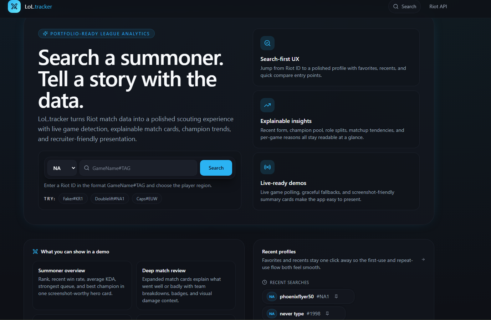
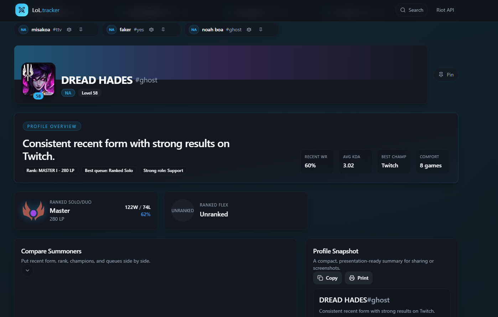

# Morello

> Understand your losses. Fix your mistakes. Climb faster.


### Landing page


### Summoner overview


---

## Overview

Morello is a coaching-first League of Legends platform built with Next.js 14 and the Riot Games API. Search your Riot ID and get a per-game breakdown of what hurt your performance, what held up, and exactly what to work on next.

Most stat sites bury you in numbers. Morello is opinionated about what matters: not just *what* happened in a game, but *why*, and *what to do about it*. Every surface — match cards, session insights, champion analysis, win/loss comparisons — is designed to produce an actionable answer, not a spreadsheet.

---

## Features

### Summoner Profiles
- **Search any Riot ID** across all supported League of Legends platforms (NA, EUW, KR, and more)
- **Ranked overview** — Solo/Duo and Flex rank, LP, win rate, and recent form at a glance
- **Live game detection** — surfaces mode, champion, and elapsed time when the summoner is in-game
- **Recent searches & favorites** — locally persisted profile shortcuts for fast revisit
- **Profile snapshot** — shareable, export-style summary panel
- **Compare mode** — search a second summoner and compare recent form, rank, and champion pool side by side

### Match History
- **Filterable by champion and queue** — visible match set stays consistent across every analytics card
- **KDA trend sparkline** — rolling KDA trend across the most recent matches
- **Session insights** — aggregate W/L, KDA, CS/min, streaks, and status label over the loaded match window
- **Paginated loading** — load deeper match history beyond the initial batch

### Match Cards (tabbed detail view)
Each match card expands into four lazy-loaded tabs:

| Tab | Content |
|-----|---------|
| **Post Game** | Coaching analysis (what hurt / what held up / focus note) + 10-player team breakdown with relative damage bars |
| **Performance** | CS/min, deaths, kill participation, damage share, vision score — colour-coded green/yellow/red against the player's own recent average |
| **Item Build** | Final build and trinket with DDragon icons and hover names. Purchase order is a roadmap item pending Riot timeline endpoint integration. |
| **Metrics** | Full stat table — damage dealt/taken, healing, shielding, CC time, turret damage, vision score, wards placed/killed — player vs team average |

### Analytics
- **Win vs loss breakdown** — side-by-side stat comparison showing how KDA, CS, vision, and objective control shift between outcomes
- **Champion matchup win rates** — deduplication enforced: a champion appears in at most one column (Best Into or Watch Outs), kept in whichever has the stronger signal (`|winRate − 50|`)
- **Role performance** — win rate, KDA, and CS/min per role (minimum 2 games)
- **Game-length buckets** — performance split across short (<25 min), medium (25–35 min), and long (>35 min) games
- **Champion mastery trends** — KDA direction (improving / cooling off / stable) per champion over visible matches
- **Scouting report** — deterministic coaching observations derived from match patterns
- **Performance badges** — MVP, Carry, Vision Leader, Objective Threat, and more, derived from match data relative to the full lobby

### High-Elo Coaching Widgets (≥5 matches)
- **Death Review** — identifies peak-death game phase (early/mid/late) from game-length bucket data and generates a deterministic coaching callout
- **Consistency Score** — 0–100 score derived from KDA, CS/min, and vision score variance (coefficient of variation); bars show stability per metric; interpreted as consistent, moderate, or streaky
- **Win Condition Fingerprint** — identifies which stat thresholds (KDA > 3.0, deaths < 3, CS/min > 6, kill participation > 60%, etc.) correlate most strongly with wins and losses across the visible match window

### Champion Tier List
- Sourced from **Lolalytics CDN** — win rate, pick rate, and ban rate aggregated from millions of Platinum+ games per patch
- Tiered by actual win rate: S (>52%), A (50–52%), B (48–50%), C (46–48%), D (<46%)
- Filterable by role; champion search; sorted win rate descending within each tier
- Falls back to **Meraki Analytics** (pick-rate tiers only) if Lolalytics is unreachable; cached 1 hour

---

## Tech Stack

| Layer | Choice | Notes |
|-------|--------|-------|
| Framework | Next.js 14 App Router | SSR, API routes, file-based routing |
| Language | TypeScript (strict) | Strict mode throughout; `npm run typecheck` is the correctness gate |
| Styling | Tailwind CSS 3 + shadcn/ui | CSS variable–based design tokens |
| UI primitives | Radix UI | Tabs, slots — unstyled, accessible |
| Client caching | TanStack Query v5 | Query deduplication, background refresh |
| State / persistence | Zustand + persist | Recent searches and favorites in localStorage |
| Icons | lucide-react | Consistent icon set |
| Typeface | Inter (next/font/google) | Zero layout shift, variable font |
| Match & ranked data | Riot Games API v5 | Account lookup, summoner, ranked, match history, spectator |
| Static assets | Data Dragon + Community Dragon | Champion icons, item icons, spell icons, rank emblems |
| Tier list (primary) | Lolalytics CDN (`axe.lolalytics.com`) | Win/pick/ban rates, Plat+, no API key required, 1-hour cache |
| Tier list (fallback) | Meraki Analytics CDN | Pick-rate only; activates when Lolalytics is unreachable |

---

## Architecture

```
web/
  app/
    page.tsx                          # landing — search, examples, feature overview
    layout.tsx                        # app shell, metadata, Inter font, Navbar
    globals.css                       # design tokens (CSS variables), utility classes
    api/
      profile/[platform]/[name]/[tag] # account + summoner + ranked entries
      matches/[platform]/[puuid]      # match IDs and full match detail (paginated)
      live/[platform]/[puuid]         # spectator polling route
      ddragon/version/                # Data Dragon latest version resolution
      tierlist/                       # Lolalytics → Meraki fallback → ChampionTierEntry[]
    tierlist/
      page.tsx                        # tier list SSR entry point
      loading.tsx                     # streaming skeleton
    summoner/[platform]/[riotId]/
      page.tsx                        # summoner profile (SSR entry point)
      loading.tsx                     # streaming skeleton
      not-found.tsx                   # 404 handling
      MatchHistory.tsx                # client component — filters, analytics, pagination
  components/                         # 32 product surfaces and UI primitives
  lib/
    riot.ts                           # Riot API wrapper (RiotError, platform/regional routing)
    ddragon.ts                        # Data Dragon asset URL builders, 12-hour module cache
    match-insights.ts                 # all analytics derivations (pure functions, no async)
    badges.ts                         # getMatchBadges, getMatchAnalysis, damageShareForTeam
    types.ts                          # shared TypeScript interfaces
    regions.ts / queues.ts            # platform routing and queue ID config maps
    utils.ts                          # formatDuration, timeAgo, kdaRatio, cn
  store/
    useRecentSearches.ts              # Zustand — recent searches and favorites
  providers/
    QueryProvider.tsx                 # TanStack Query client wrapper
```

### Data flow

1. The landing page captures a Riot ID (`GameName#TAG`), resolves the platform, and navigates to the summoner route.
2. The summoner page server-renders account data, ranked stats, live game summary, and the first 20 matches in parallel. `deriveProfileOverview()` runs synchronously in SSR.
3. `MatchHistory.tsx` owns all client state — queue/champion filters, pagination, and the full `useMemo` analytics layer. All derivations run on the same `visibleMatches` slice so every card stays consistent when filters change.
4. Live game polling refreshes independently on the client and fails soft when spectator data is unavailable.
5. Match card tabs are lazy: tab content is only mounted on first click and stays in the DOM thereafter.

### Analytics API (`lib/match-insights.ts`)

All functions are pure: `(matches: MatchDTO[], puuid: string) → result`. No async, no side-effects, SSR-safe.

| Function | Returns |
|----------|---------|
| `deriveSessionInsights` | W/L, KDA, CS/min, streaks, best champion, status label |
| `deriveMatchupInsights` | Best/worst champion matchups (deduped by signal strength) |
| `deriveRoleInsights` | Per-role W/L, KDA, CS/min |
| `deriveScoutingReport` | Up to 5 coaching observations as strings |
| `deriveWinLossComparison` | Side-by-side metric diff across wins and losses |
| `deriveGameLengthBuckets` | Performance split across short / medium / long games |
| `deriveChampionTrends` | KDA direction per champion over visible matches |
| `deriveDeathReview` | Peak-death phase inference + coaching callout |
| `deriveConsistencyScore` | 0–100 score from KDA / CS / vision coefficient of variation |
| `deriveWinConditionFingerprint` | Stat thresholds that correlate with wins/losses |
| `deriveProfileOverview` | SSR summary line for the profile header |

### Critical invariants

- **Platform vs regional routing** — account lookup and match IDs use the regional cluster (`americas`, `europe`, `asia`, `sea`); summoner data and match details use the platform cluster (`na1`, `euw1`, etc.). `lib/regions.ts` exports `regionalFor(platform)`. Mixing them causes silent 404s.
- **No new API calls for analytics** — all derivations are pure functions over already-fetched `MatchDTO[]`. Adding Riot calls to the analytics path would break SSR and add latency.
- **Coaching strings are deterministic** — `getMatchAnalysis()` and all `derive*` functions are synchronous and threshold-based. No LLM calls, no randomness, no async.
- **Riot ID encoding** — URL slug uses a hyphen as the name/tag separator (`GameName-TAG`). The summoner page splits on `lastIndexOf("-")` because game names can contain hyphens; tags cannot.

---

## Getting Started

### Prerequisites

- Node.js 18+
- A [Riot Games developer API key](https://developer.riotgames.com/) (development keys reset every 24 hours)

### Installation

```bash
cd web
npm install
```

### Environment variables

Create `web/.env.local`:

```bash
RIOT_API_KEY=your_riot_api_key_here
```

### Running locally

```bash
npm run dev       # localhost:3000
```

Try the example summoners on the landing page — `Hide on bush#KR1` (KR), `Caedrel#EUW` (EUW), `CoreJJ#NA1` (NA) — to verify the full pipeline is working.

### Commands

```bash
npm run dev          # development server
npm run build        # production build
npm run start        # production server
npm run typecheck    # tsc --noEmit — run after every change
npm run lint         # ESLint via next lint
```

### Production deployment

Deploy to any platform with Next.js 14 App Router support. [Vercel](https://vercel.com) is the simplest option — set `RIOT_API_KEY` in project environment variables.

---

## Known Limitations

- **Timeline data** — lane phase analysis (CS differentials at 15, per-death timestamps, item purchase order) requires the Riot timeline endpoint, which is a separate fetch not currently in the pipeline. The Item Build tab shows final build only; purchase sequence is a roadmap item.
- **Live game polling** — depends on Riot's spectator API availability and account-level access; fails soft when unavailable.
- **Analytics scope** — all insights are scoped to the loaded match window, not a player's full history.
- **Riot API key** — development keys from Riot expire every 24 hours and have strict rate limits; production use requires a production key application.
- **Recent searches** — browser-local only, not synced across devices.

---

## Roadmap

- Timeline-aware lane phase analysis (CS differentials, item purchase sequence, per-death events)
- Patch-aware context — flag performance changes that coincide with balance patches
- Image-based profile export snapshots
- Cloud-synced favorites with optional account authentication

---

## License

MIT. League of Legends and Riot Games are trademarks or registered trademarks of Riot Games, Inc. Morello is not endorsed by or affiliated with Riot Games.

---

## Contact

Noah Russell  
[LinkedIn](https://www.linkedin.com/in/noah-russell-cs/)  
[Email](mailto:noahrusselldev@gmail.com)
